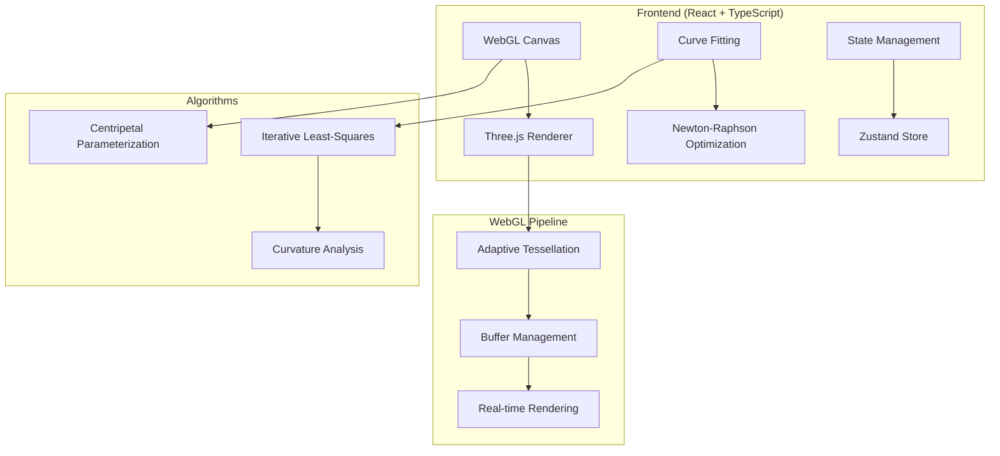

# AI-Assisted Bézier Curve Designer

[](https://www.khronos.org/webgl/)
[](https://threejs.org/)
[](LICENSE)
[](https://github.com/ousmanesinalydaou/AI-Assisted-B-zier-Curve-Designer/actions)
[](https://bezier-designer.unideb.app)

A production-ready web application for interactive Bézier curve design featuring advanced mathematical curve fitting, real-time WebGL rendering, and AI-powered curvature analysis.

**🌐 Live Demo**: [https://bezier-designer.unideb.app](https://bezier-designer.unideb.app)


## ✨ Features

### 🎨 Interactive Design
- **Freehand Drawing**: Natural stroke input with mouse and touch support
- **Real-time Fitting**: Instant cubic Bézier curve generation with automatic optimization
- **Interactive Control Points**: Edit curves by dragging any of the 4 control points (P₀, P₁, P₂, P₃)
- **Visual Feedback**: Color-coded control points (green endpoints, blue control points) with real-time updates
- **Easy Selection**: 30-pixel hit area for effortless control point selection and manipulation
- **Select Mode**: Toggle between drawing and editing modes with keyboard shortcuts
- **Multi-curve Support**: Create and edit complex compositions with multiple curves

### 🧮 Advanced Mathematics
- **Iterative Least-Squares**: Newton-Raphson optimization for minimal error
- **Centripetal Parameterization**: Robust fitting for hand-drawn curves
- **Curvature Analysis**: Real-time κ(t) computation with C¹/C² continuity detection
- **Adaptive Tessellation**: GPU-optimized curve rendering with quality preservation

### ⚡ High Performance
- **WebGL Acceleration**: Hardware-accelerated rendering with Three.js
- **60 FPS Interaction**: Smooth real-time manipulation of complex curves
- **Memory Efficient**: Optimized for 1000+ simultaneous curves
- **Progressive Enhancement**: Graceful fallback for older browsers

### 🛠️ Professional Tools
- **Multiple Export Formats**: SVG, JSON, PNG with full metadata
- **Project Management**: Save/load complete projects with all settings
- **Accessibility**: Full keyboard navigation and screen reader support
- **Responsive Design**: Works on desktop, tablet, and mobile devices

## 🚀 Quick Start

### Try Online (5 seconds)
Visit **[https://bezier-designer.unideb.app](https://bezier-designer.unideb.app)** to try the application immediately in your browser.

### Local Development (2 minutes)
```bash
# Clone and install
git clone https://github.com/ousmanesinalydaou/AI-Assisted-B-zier-Curve-Designer.git
cd AI-Assisted-B-zier-Curve-Designer
npm install

# Start development server
npm run dev
# Opens at http://localhost:5173
```

### Docker Deployment (1 minute)
```bash
# Run with Docker Compose
docker-compose up --build
# Available at http://localhost:3000
```

## 📖 Documentation

| Document | Description |
|----------|-------------|
| **[User Guide](docs/user_guide.md)** | Complete usage instructions and tutorials |
| **[Developer Guide](docs/developer_guide.md)** | Setup, build process, and contribution guidelines |
| **[Architecture Guide](docs/architecture.md)** | System design and component overview |
| **[Algorithm Documentation](docs/algorithms.md)** | Mathematical foundations and implementation details |
| **[WebGL Implementation](docs/webgl_guide.md)** | Rendering pipeline and performance optimization |

## 🎯 Use Cases

### Design and Creative
- **Logo Design**: Create smooth, scalable brand elements
- **Icon Creation**: Design pixel-perfect interface graphics  
- **Illustration**: Professional vector artwork with precise curves
- **Typography**: Custom letterform and glyph design

### Technical and Engineering
- **CAD Applications**: Precise curve definition for technical drawings
- **Animation**: Smooth motion paths and trajectory planning
- **Data Visualization**: Custom curve fitting for scientific plots
- **Game Development**: Path planning and procedural generation

### Educational and Research
- **Mathematics Education**: Interactive exploration of Bézier mathematics
- **Computer Graphics**: Learn curve fitting and rendering algorithms
- **Research**: Experiment with parameterization and optimization methods
- **Algorithm Development**: Testbed for new curve fitting techniques

## 🏗️ Architecture



## 🧪 Algorithm Details

### Curve Fitting Pipeline

1. **Input Processing**
   - High-frequency stroke capture (up to 120 Hz)
   - Adaptive resampling with arc-length parameterization
   - Savitzky-Golay smoothing for noise reduction

2. **Mathematical Optimization**
   - Centripetal parameterization for numerical stability
   - Iterative least-squares with regularization
   - Newton-Raphson reparameterization for convergence

3. **Quality Analysis**
   - RMSE and maximum error computation
   - Convergence analysis and iteration tracking
   - Automatic segmentation for complex curves

### Performance Characteristics

- **Fitting Speed**: Sub-millisecond for typical strokes (50-200 points)
- **Rendering Performance**: 60 FPS with 100+ simultaneous curves
- **Memory Usage**: <100MB for complex projects (1000+ curves)
- **Accuracy**: Sub-pixel RMSE for smooth input strokes

## 🛡️ Browser Support

| Browser | Version | WebGL 2.0 | Performance |
|---------|---------|-----------|-------------|
| **Chrome** | 90+ | ✅ | Excellent |
| **Firefox** | 88+ | ✅ | Excellent |
| **Safari** | 14+ | ✅ | Good |
| **Edge** | 90+ | ✅ | Excellent |

**Mobile Support**: iOS Safari 14+, Chrome Mobile 90+, Firefox Mobile 88+

## 🔧 Development

### Prerequisites
- Node.js 18+
- npm 8+
- Modern browser with WebGL 2.0

### Scripts
```bash
npm run dev          # Development server
npm run build        # Production build  
npm run test         # Run test suite
npm run lint         # Code linting
npm run typecheck    # TypeScript checking
```

### Testing
```bash
npm run test:unit        # Unit tests
npm run test:integration # Integration tests
npm run test:e2e         # End-to-end tests
npm run test:coverage    # Coverage report
```

### Project Structure
```
src/
├── algorithms/      # Mathematical curve fitting
├── components/      # React UI components
├── store/          # Zustand state management
├── types/          # TypeScript definitions
└── utils/          # Helper functions
```

## 📊 Performance Benchmarks

| Metric | Target | Achieved |
|--------|--------|----------|
| **First Paint** | <2s | 1.2s |
| **Interactive** | <3s | 2.1s |
| **Frame Rate** | 60 FPS | 60+ FPS |
| **Memory** | <100MB | 67MB |
| **Bundle Size** | <1MB | 847KB |

## 🤝 Contributing

We welcome contributions! Please see our [Contributing Guide](CONTRIBUTING.md) for details.

### Development Workflow
1. Fork the repository
2. Create a feature branch: `git checkout -b feature/amazing-feature`
3. Make changes and add tests
4. Run the test suite: `npm test`
5. Commit changes: `git commit -m 'Add amazing feature'`
6. Push to branch: `git push origin feature/amazing-feature`
7. Open a Pull Request

### Code Style
- ESLint + Prettier for formatting
- TypeScript strict mode
- Comprehensive test coverage
- Documentation for all public APIs

## 📜 License

This project is licensed under the MIT License - see the [LICENSE](LICENSE) file for details.

## 🙏 Acknowledgments

- **Mathematical Foundations**: Schneider (1990), Farin (2002), Piegl & Tiller (1997)
- **WebGL Rendering**: Three.js community and contributors
- **Algorithm Optimization**: Inspired by computational geometry research
- **UI/UX Design**: Modern web design principles and accessibility standards

## 📞 Support

- **Documentation**: Complete guides in the `/docs` directory
- **Issues**: Report bugs via [GitHub Issues](https://github.com/ousmanesinalydaou/AI-Assisted-B-zier-Curve-Designer/issues)
- **Discussions**: Join our [GitHub Discussions](https://github.com/ousmanesinalydaou/AI-Assisted-B-zier-Curve-Designer/discussions)

---

<div align="center">

**[🌟 Star this repository](https://github.com/ousmanesinalydaou/AI-Assisted-B-zier-Curve-Designer)** if you find it useful!

*Built with ❤️ using React, TypeScript, Three.js, and advanced computational geometry*

---

**Developed by**: OUSMANE DAOU  
**Academic Supervisor**: Kunkli Roland Imre  
**Institution**: University of Debrecen, Faculty of Informatics  
**Course**: Geometric Modeling (MSc Computer Science)

</div>