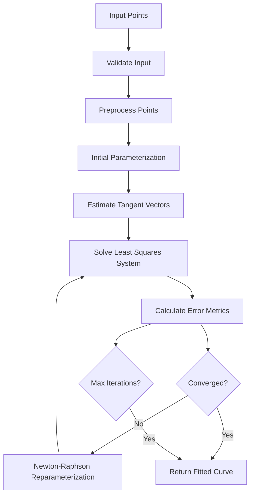

# Algorithm Documentation

## Mathematical Foundations

This document provides comprehensive coverage of the mathematical algorithms used in the Bézier Curve Designer, including detailed derivations, pseudocode implementations, and numerical stability considerations.

## 1. Cubic Bézier Curve Fundamentals

### Mathematical Definition

A cubic Bézier curve is defined by four control points P₀, P₁, P₂, P₃ and parameter t ∈ [0,1]:

```
B(t) = (1-t)³P₀ + 3(1-t)²tP₁ + 3(1-t)t²P₂ + t³P₃
```

Where the Bernstein basis polynomials are:
- B₀,₃(t) = (1-t)³
- B₁,₃(t) = 3(1-t)²t  
- B₂,₃(t) = 3(1-t)t²
- B₃,₃(t) = t³

### First and Second Derivatives

The first derivative (tangent vector):
```
B'(t) = 3(1-t)²(P₁ - P₀) + 6(1-t)t(P₂ - P₁) + 3t²(P₃ - P₂)
```

The second derivative (acceleration vector):
```
B''(t) = 6(1-t)(P₂ - 2P₁ + P₀) + 6t(P₃ - 2P₂ + P₁)
```

## 2. Curve Fitting Algorithm

### Overview

Our curve fitting algorithm is based on the iterative least-squares method with Newton-Raphson reparameterization, following the approach described by Schneider (1990) and refined by Farin (2002).

### Algorithm Flow



### 2.1 Point Parameterization

#### Centripetal Parameterization (Recommended)

The centripetal method provides the most stable results for hand-drawn curves:

```
t₀ = 0
tᵢ = tᵢ₋₁ + √(||Pᵢ - Pᵢ₋₁||) for i = 1, ..., n-1
Normalize: tᵢ = tᵢ / t_{n-1}
```

**Mathematical Justification**: Centripetal parameterization minimizes second-order effects and prevents cusps and loops in the parameterization, making it ideal for fitting smooth curves to noisy input data.

#### Implementation

```python
def parameterize_centripetal(points):
    """
    Centripetal parameterization for robust curve fitting
    
    Args:
        points: List of 2D points [(x, y), ...]
    
    Returns:
        parameters: List of normalized parameters [0, ..., 1]
    """
    n = len(points)
    if n < 2:
        return [0.0] if n == 1 else []
    
    # Calculate cumulative square root distances
    distances = [0.0]
    total_distance = 0.0
    
    for i in range(1, n):
        dx = points[i][0] - points[i-1][0]
        dy = points[i][1] - points[i-1][1]
        segment_distance = sqrt(dx*dx + dy*dy)
        total_distance += segment_distance
        distances.append(total_distance)
    
    # Normalize to [0, 1]
    if total_distance == 0:
        return [i / (n-1) for i in range(n)]
    
    return [d / total_distance for d in distances]
```

#### Comparison of Parameterization Methods

| Method | Stability | Accuracy | Speed | Use Case |
|--------|-----------|----------|-------|-----------|
| Uniform | Low | Poor | Fast | Simple curves only |
| Chord-length | Medium | Good | Medium | General purpose |
| **Centripetal** | **High** | **Excellent** | Medium | **Hand-drawn curves** |

### 2.2 Least Squares Fitting

#### Mathematical Setup

Given n data points Q₁, ..., Qₙ with parameters t₁, ..., tₙ, we want to minimize:

```
E = Σᵢ₌₁ⁿ ||B(tᵢ) - Qᵢ||²
```

With fixed endpoints P₀ = Q₁ and P₃ = Qₙ, we solve for P₁ and P₂.

#### Tangent Vector Estimation

Left tangent vector at t=0:
```
T₁ = normalize(Q₂ - Q₁)  // For simple estimation
// Or use finite differences for better accuracy:
T₁ = normalize(3(Q₂ - Q₁) - 0.5(Q₃ - Q₁))
```

Right tangent vector at t=1:
```
T₂ = normalize(Qₙ₋₁ - Qₙ)
// Or: T₂ = normalize(3(Qₙ₋₁ - Qₙ) - 0.5(Qₙ₋₂ - Qₙ))
```

#### Linear System Setup

The control points are expressed as:
```
P₁ = P₀ + α₁ · T₁
P₂ = P₃ + α₂ · T₂
```

This reduces the problem to solving for scalars α₁ and α₂.

Setting up the normal equations AᵀAx = Aᵀb:

```python
def solve_control_points(points, parameters, tangent1, tangent2):
    """
    Solve least squares system for control points
    
    Mathematical Details:
    - Build matrix A where each row contains Bernstein basis evaluations
    - Solve normal equations (AᵀA)x = Aᵀb for optimal α₁, α₂
    - Add regularization for numerical stability
    """
    n = len(points)
    p0, p3 = points[0], points[-1]
    
    # Build coefficient matrix and right-hand side
    C00 = C01 = C11 = 0.0  # AᵀA matrix elements
    X0 = X1 = Y0 = Y1 = 0.0  # Aᵀb vector elements
    
    for i in range(n):
        t = parameters[i]
        ti = 1.0 - t
        
        # Bernstein basis functions
        B0 = ti * ti * ti
        B1 = 3 * ti * ti * t
        B2 = 3 * ti * t * t
        B3 = t * t * t
        
        # Coefficients for unknowns α₁, α₂
        A1x, A1y = B1 * tangent1[0], B1 * tangent1[1]
        A2x, A2y = B2 * tangent2[0], B2 * tangent2[1]
        
        # Accumulate matrix elements
        C00 += A1x * A1x + A1y * A1y
        C01 += A1x * A2x + A1y * A2y
        C11 += A2x * A2x + A2y * A2y
        
        # Right-hand side
        px = points[i][0] - (B0 * p0[0] + B3 * p3[0])
        py = points[i][1] - (B0 * p0[1] + B3 * p3[1])
        
        X0 += A1x * px
        Y0 += A1y * py
        X1 += A2x * px
        Y1 += A2y * py
    
    # Add regularization to prevent singular matrices
    regularization = 1e-6
    C00 += regularization
    C11 += regularization
    
    # Solve 2x2 system
    det = C00 * C11 - C01 * C01
    if abs(det) < 1e-10:
        # Fallback to simple estimation
        alpha1 = distance(p0, p3) * 0.25
        alpha2 = distance(p0, p3) * 0.25
    else:
        alpha1 = ((X0 + Y0) * C11 - (X1 + Y1) * C01) / det
        alpha2 = ((X1 + Y1) * C00 - (X0 + Y0) * C01) / det
    
    # Ensure minimum distance to avoid degenerate curves
    min_distance = distance(p0, p3) * 0.05
    alpha1 = max(alpha1, min_distance)
    alpha2 = max(alpha2, min_distance)
    
    # Calculate control points
    p1 = (p0[0] + alpha1 * tangent1[0], p0[1] + alpha1 * tangent1[1])
    p2 = (p3[0] + alpha2 * tangent2[0], p3[1] + alpha2 * tangent2[1])
    
    return [p0, p1, p2, p3]
```

### 2.3 Newton-Raphson Reparameterization

#### Theoretical Foundation

For each data point Qᵢ, we find the parameter t* that minimizes the distance to the curve:

```
min ||B(t) - Qᵢ||²
```

The necessary condition is:
```
d/dt ||B(t) - Qᵢ||² = 2(B(t) - Qᵢ) · B'(t) = 0
```

This gives us the equation f(t) = (B(t) - Qᵢ) · B'(t) = 0.

#### Newton-Raphson Iteration

```
t_{k+1} = t_k - f(t_k)/f'(t_k)
```

Where:
```
f(t) = (B(t) - Qᵢ) · B'(t)
f'(t) = B'(t) · B'(t) + (B(t) - Qᵢ) · B''(t)
```

#### Implementation

```python
def newton_raphson_projection(curve, point, t_initial, max_iterations=5):
    """
    Find parameter t that minimizes distance from point to curve
    
    Uses Newton-Raphson method to solve:
    (B(t) - Q) · B'(t) = 0
    """
    t = t_initial
    
    for iteration in range(max_iterations):
        # Evaluate curve and derivatives
        B_t = evaluate_bezier(curve, t)
        B_prime = evaluate_bezier_derivative(curve, t)
        B_double_prime = evaluate_bezier_second_derivative(curve, t)
        
        # Function and its derivative
        diff = (B_t[0] - point[0], B_t[1] - point[1])
        f = diff[0] * B_prime[0] + diff[1] * B_prime[1]
        f_prime = (B_prime[0] * B_prime[0] + B_prime[1] * B_prime[1] + 
                   diff[0] * B_double_prime[0] + diff[1] * B_double_prime[1])
        
        # Check for convergence or singular derivative
        if abs(f) < 1e-6:
            break
        if abs(f_prime) < 1e-10:
            break
            
        # Newton-Raphson update
        t_new = t - f / f_prime
        
        # Clamp to valid parameter range
        t_new = max(0.0, min(1.0, t_new))
        
        # Check convergence
        if abs(t_new - t) < 1e-6:
            break
            
        t = t_new
    
    return t
```

## 3. Curvature Analysis

### Curvature Formula

For a parametric curve B(t), the curvature κ(t) is:

```
κ(t) = |B'(t) × B''(t)| / ||B'(t)||³
```

For 2D curves, the cross product becomes:
```
κ(t) = |B'ₓ(t) · B''ᵧ(t) - B'ᵧ(t) · B''ₓ(t)| / (B'ₓ(t)² + B'ᵧ(t)²)^(3/2)
```

### Implementation

```python
def calculate_curvature(curve, t):
    """
    Calculate curvature at parameter t
    
    Returns:
        curvature: Scalar curvature value (1/radius)
        radius: Radius of curvature (can be infinite)
    """
    # First and second derivatives
    B_prime = evaluate_bezier_derivative(curve, t)
    B_double_prime = evaluate_bezier_second_derivative(curve, t)
    
    # Cross product magnitude (2D)
    cross_product = (B_prime[0] * B_double_prime[1] - 
                    B_prime[1] * B_double_prime[0])
    
    # Speed (magnitude of first derivative)
    speed_squared = B_prime[0]**2 + B_prime[1]**2
    
    if speed_squared < 1e-10:
        return 0.0, float('inf')  # No curvature at stationary point
    
    speed = sqrt(speed_squared)
    curvature = abs(cross_product) / (speed_squared * speed)
    
    radius = 1.0 / curvature if curvature > 1e-10 else float('inf')
    
    return curvature, radius
```

### Continuity Analysis

#### C¹ Continuity (Tangent Continuity)
Two curves are C¹ continuous if their tangent vectors align at the junction:

```python
def check_c1_continuity(curve1, curve2, tolerance=1e-3):
    """Check C1 continuity between two curves"""
    # Tangent at end of first curve
    t1_end = evaluate_bezier_derivative(curve1, 1.0)
    # Tangent at start of second curve  
    t2_start = evaluate_bezier_derivative(curve2, 0.0)
    
    # Normalize tangent vectors
    t1_norm = normalize_vector(t1_end)
    t2_norm = normalize_vector(t2_start)
    
    # Check alignment (dot product should be ±1)
    dot_product = t1_norm[0] * t2_norm[0] + t1_norm[1] * t2_norm[1]
    
    return abs(abs(dot_product) - 1.0) < tolerance
```

#### C² Continuity (Curvature Continuity)
Requires both tangent and curvature continuity:

```python
def check_c2_continuity(curve1, curve2, tolerance=1e-3):
    """Check C2 continuity between two curves"""
    if not check_c1_continuity(curve1, curve2, tolerance):
        return False
    
    # Curvature at junction points
    k1_end = calculate_curvature(curve1, 1.0)[0]
    k2_start = calculate_curvature(curve2, 0.0)[0]
    
    return abs(k1_end - k2_start) < tolerance
```

## 4. Curve Segmentation

### Automatic Segmentation Algorithm

When a single cubic Bézier cannot adequately represent the input stroke, we automatically segment it:

```python
def segment_curve_adaptive(points, max_error=2.0, min_segment_length=10):
    """
    Adaptively segment a stroke into multiple Bézier curves
    
    Args:
        points: Input stroke points
        max_error: Maximum allowable fitting error
        min_segment_length: Minimum points per segment
    
    Returns:
        segments: List of point segments for individual curve fitting
    """
    segments = []
    current_start = 0
    
    while current_start < len(points) - min_segment_length:
        # Try increasingly longer segments
        best_end = current_start + min_segment_length
        
        for end in range(current_start + min_segment_length, len(points)):
            segment_points = points[current_start:end+1]
            
            try:
                # Attempt to fit curve to this segment
                curve = fit_cubic_bezier(segment_points)
                error = calculate_fitting_error(segment_points, curve)
                
                if error <= max_error:
                    best_end = end
                else:
                    break  # Error too high, use previous best
                    
            except Exception:
                break  # Fitting failed, use previous best
        
        # Add segment
        segments.append(points[current_start:best_end+1])
        current_start = best_end
    
    return segments
```

## 5. Numerical Stability and Error Handling

### Regularization Techniques

1. **Matrix Regularization**: Add small values to diagonal elements
```python
C00 += regularization_factor  # Typically 1e-6
C11 += regularization_factor
```

2. **Parameter Clamping**: Ensure parameters stay within valid bounds
```python
t = max(0.0, min(1.0, t))  # Clamp to [0,1]
alpha = max(min_distance, alpha)  # Prevent degenerate control points
```

3. **Convergence Checking**: Multiple termination criteria
```python
# Absolute error tolerance
if rmse < absolute_tolerance:
    converged = True

# Relative improvement threshold  
if abs(current_error - previous_error) / previous_error < relative_tolerance:
    converged = True

# Maximum iterations safety
if iteration >= max_iterations:
    converged = True
```

### Error Metrics

#### Root Mean Square Error (RMSE)
```python
def calculate_rmse(points, curve, parameters):
    """Calculate root mean square error"""
    errors = []
    for i, point in enumerate(points):
        curve_point = evaluate_bezier(curve, parameters[i])
        error = distance(point, curve_point)
        errors.append(error * error)
    
    return sqrt(sum(errors) / len(errors))
```

#### Maximum Error
```python
def calculate_max_error(points, curve, parameters):
    """Calculate maximum deviation error"""
    max_error = 0.0
    for i, point in enumerate(points):
        curve_point = evaluate_bezier(curve, parameters[i])
        error = distance(point, curve_point)
        max_error = max(max_error, error)
    
    return max_error
```

## 6. Complexity Analysis

### Time Complexity
- **Initial Parameterization**: O(n) where n = number of points
- **Tangent Estimation**: O(1) 
- **Least Squares Setup**: O(n)
- **Newton-Raphson Iteration**: O(n × k) where k = iterations per point
- **Overall per iteration**: O(n)
- **Total Algorithm**: O(n × m) where m = fitting iterations

### Space Complexity
- **Point Storage**: O(n) for input points
- **Parameter Storage**: O(n) for parameter arrays
- **Matrix Storage**: O(1) for 2×2 coefficient matrix
- **Overall**: O(n)

### Convergence Properties
- **Typical Convergence**: 3-8 iterations for hand-drawn curves
- **Worst Case**: Bounded by max_iterations parameter
- **Convergence Rate**: Quadratic for Newton-Raphson (when applicable)

This mathematical foundation provides robust, production-ready curve fitting with excellent numerical stability and performance characteristics suitable for real-time interactive applications.