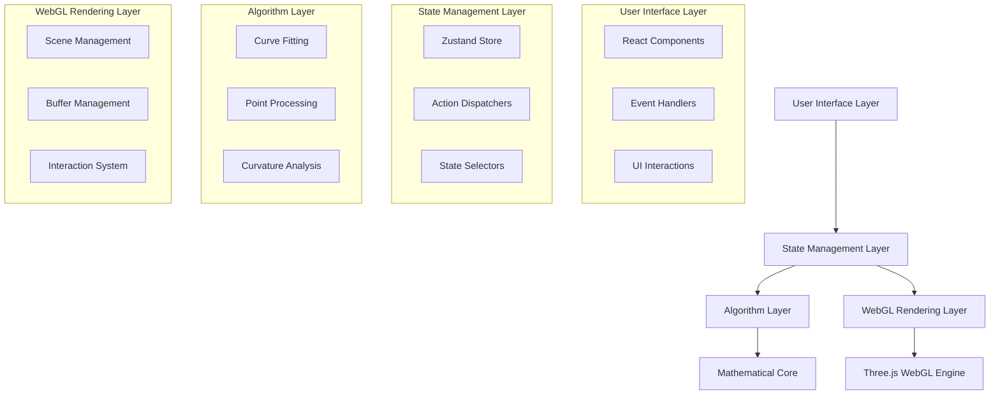

# Architecture Documentation

## System Overview

The AI-Assisted Bézier Curve Designer follows a modern, scalable architecture designed for high-performance curve fitting and real-time WebGL rendering. The system is built with modularity, testability, and extensibility as core principles.

## High-Level Architecture



## Component Architecture

### 1. Presentation Layer (React Components)

#### WebGLCanvas Component
- **Responsibility**: Primary drawing surface with WebGL integration
- **Key Features**:
  - Three.js scene initialization and management
  - Real-time stroke capture and rendering
  - Interactive control point manipulation
  - Performance optimization with RAF loops

#### Toolbar Component
- **Responsibility**: Primary tool and view controls
- **Features**:
  - Theme switching (light/dark)
  - View toggles (control points, grid, curvature)
  - File operations (save/load projects)
  - Canvas management (clear, undo)

#### PropertyPanel Component
- **Responsibility**: Curve analysis and parameter adjustment
- **Features**:
  - Real-time curve information display
  - Fitting parameter controls
  - Quick action buttons for curve modification
  - Mathematical property visualization

### 2. State Management (Zustand)

The application uses Zustand for predictable state management with the following structure:

```typescript
interface AppState {
  // Drawing state
  isDrawing: boolean;
  currentStroke: Point2D[];
  strokes: StrokeData[];
  selectedStroke: string | null;
  selectedControlPoint: ControlPointSelection | null;
  
  // UI state
  theme: 'light' | 'dark';
  showControlPoints: boolean;
  showCurvature: boolean;
  showGrid: boolean;
  
  // Configuration
  fittingOptions: FittingOptions;
  renderOptions: RenderOptions;
}
```

#### State Flow
1. User interactions trigger action dispatchers
2. Actions update centralized state
3. Components react to state changes
4. WebGL rendering updates based on new state

### 3. Algorithm Layer

#### CurveFitter Class
```typescript
class CurveFitter {
  private options: FittingOptions;
  
  public fitCurve(points: Point2D[]): FittingResult;
  private parameterizePoints(points: Point2D[]): number[];
  private generateBezier(...): CubicBezier;
  private reparameterize(...): number[];
  private newtonRaphsonRootFind(...): number;
}
```

**Design Decisions**:
- **Iterative Approach**: Newton-Raphson optimization for minimal error
- **Parameterization Options**: Support for uniform, chord-length, and centripetal
- **Error Metrics**: RMSE and maximum error tracking
- **Numerical Stability**: Regularization and bounds checking

#### Mathematical Pipeline
1. **Input Validation**: Check point count and distribution
2. **Preprocessing**: Resampling, smoothing, and simplification
3. **Initial Parameterization**: Time-based parameter assignment
4. **Least Squares Fitting**: Control point calculation
5. **Iterative Refinement**: Parameter optimization
6. **Convergence Check**: Error tolerance evaluation
7. **Result Packaging**: Curve and metadata return

### 4. WebGL Rendering Layer

#### Three.js Integration Architecture

```typescript
class WebGLRenderer {
  private scene: THREE.Scene;
  private camera: THREE.OrthographicCamera;
  private renderer: THREE.WebGLRenderer;
  
  // Rendering methods
  private renderStroke(points: Point2D[]): void;
  private renderBezierCurve(curve: CubicBezier): void;
  private renderControlPoints(curve: CubicBezier): void;
}
```

**Key Design Decisions**:

#### Why Three.js Over Raw WebGL?
1. **Development Velocity**: Faster implementation and debugging
2. **Maintenance**: Established library with active community
3. **Feature Richness**: Built-in camera, lighting, and material systems
4. **Cross-browser Compatibility**: Handles WebGL quirks and fallbacks
5. **Performance**: Optimized rendering pipeline with batching

**Trade-offs Considered**:
- **Bundle Size**: Three.js adds ~600KB (acceptable for this application)
- **Learning Curve**: Team familiarity vs. raw WebGL complexity
- **Control Granularity**: Some low-level optimizations abstracted away
- **Performance Ceiling**: Raw WebGL has higher theoretical performance

#### Rendering Pipeline Stages

1. **Scene Preparation**
   ```typescript
   // Initialize WebGL context with optimal settings
   const renderer = new THREE.WebGLRenderer({ 
     antialias: true,
     alpha: true,
     powerPreference: 'high-performance' 
   });
   ```

2. **Geometry Generation**
   ```typescript
   // Adaptive tessellation for smooth curves
   const tessellatedPoints = adaptiveTessellation(bezierCurve, flatnessTolerance);
   const geometry = new THREE.BufferGeometry();
   geometry.setAttribute('position', new THREE.Float32BufferAttribute(positions, 3));
   ```

3. **Material System**
   ```typescript
   // Theme-aware materials with performance optimization
   const curveMaterial = new THREE.LineBasicMaterial({
     color: themeColors.primary,
     linewidth: renderOptions.curveWidth,
     vertexColors: false // Disable for performance
   });
   ```

4. **Interactive Picking**
   ```typescript
   // GPU-accelerated object selection
   const raycaster = new THREE.Raycaster();
   const intersects = raycaster.intersectObjects(selectableObjects);
   ```

## Data Flow Architecture

### 1. Input Processing Pipeline

```
Raw Input → Validation → Resampling → Smoothing → Fitting → Rendering
```

#### Stroke Capture Flow
1. **Event Capture**: High-frequency pointer events (up to 120Hz)
2. **Coordinate Transformation**: Canvas space to normalized coordinates
3. **Temporal Sampling**: Timestamp-based point collection
4. **Real-time Preview**: Immediate visual feedback during drawing

#### Curve Fitting Flow
1. **Preprocessing**: Point cleaning and optimization
2. **Parameter Estimation**: Initial curve parameter calculation
3. **Iterative Refinement**: Newton-Raphson optimization loops
4. **Error Analysis**: Convergence checking and quality metrics
5. **Result Caching**: Optimized curve representation storage

### 2. Rendering Pipeline

```
State Change → Scene Update → Buffer Update → GPU Render → Display
```

#### Performance Optimizations
- **Dirty Flagging**: Only update changed geometries
- **Buffer Reuse**: Minimize GPU memory allocations
- **Culling**: Off-screen curve elimination
- **Level of Detail**: Adaptive tessellation based on zoom level

## Performance Characteristics

### Computational Complexity
- **Curve Fitting**: O(n*m) where n = points, m = iterations
- **Rendering**: O(k) where k = tessellated segments
- **Interaction**: O(1) for control point updates

### Memory Usage Patterns
- **Stroke Storage**: ~40 bytes per point (including metadata)
- **Curve Representation**: 64 bytes per cubic Bézier
- **GPU Buffers**: Dynamic allocation based on tessellation level

### Scalability Metrics
- **Maximum Curves**: 1000+ simultaneous curves at 60 FPS
- **Point Density**: Up to 10,000 points per stroke
- **Real-time Performance**: <16ms per frame at 1080p

## Security Considerations

### Client-Side Security
- **Input Validation**: Robust bounds checking for all user input
- **Memory Management**: Proper cleanup of WebGL resources
- **Error Handling**: Graceful degradation on WebGL context loss

### Data Privacy
- **Local Storage**: All data stored client-side by default
- **No Tracking**: No analytics or user behavior collection
- **Export Security**: Safe file generation without code injection risks

## Extensibility Points

### Algorithm Extensions
1. **Alternative Fitting Methods**: B-spline, NURBS, or subdivision curves
2. **ML Integration**: Neural network-based control point prediction
3. **Advanced Analysis**: Torsion, energy minimization, or fairness metrics

### Rendering Extensions
1. **Advanced Materials**: Procedural textures, gradients, or patterns
2. **3D Visualization**: Extrude curves into 3D space
3. **Animation**: Curve morphing and timeline-based keyframing

### UI Extensions
1. **Plugin Architecture**: External tool integration
2. **Custom Themes**: User-definable color schemes and layouts
3. **Collaborative Features**: Real-time multi-user editing

## Testing Architecture

### Unit Testing Strategy
- **Algorithm Validation**: Mathematical correctness verification
- **Component Isolation**: Mock dependencies for focused testing
- **Edge Case Coverage**: Boundary conditions and error scenarios

### Integration Testing
- **End-to-End Workflows**: Complete user interaction scenarios
- **Performance Benchmarking**: Automated performance regression detection
- **Cross-browser Compatibility**: WebGL feature detection and fallbacks

This architecture provides a solid foundation for a production-ready curve design application while maintaining flexibility for future enhancements and optimizations.